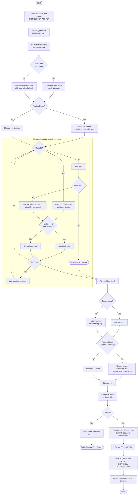
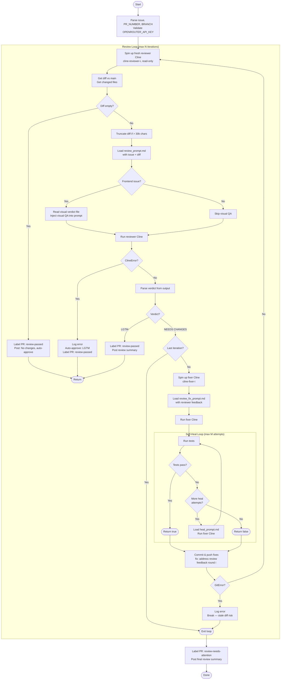
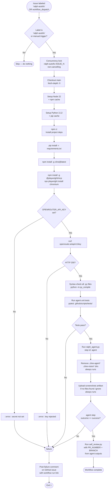
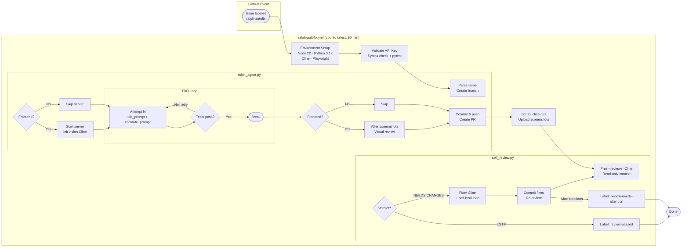

# Ralph Agent — Flow Diagrams

## Scope

Ralph is an autonomous GitHub issue resolver. It is triggered by a single label (`ralph-autofix`) and operates entirely within CI — no human intervention required from trigger to PR.

**What Ralph does:**

- Reads a GitHub issue and creates a dedicated branch
- Drives a Cline CLI coding agent in a TDD loop: write code, run tests, escalate model on failure
- For frontend issues: starts the dev server, captures before/after screenshots, and runs a visual QA pass via a vision-capable Cline instance
- Commits all changes and opens a PR with a cost report and screenshot diff
- Runs a self-review phase in fresh context: a read-only reviewer Cline inspects the diff and issues a verdict; on rejection, a fixer Cline applies corrections and the cycle repeats

**What Ralph does not do:**

- Does not handle issues without the `ralph-autofix` label
- Does not push directly to `main` — all changes land in a PR for human merge
- Does not retry indefinitely — coding attempts, review iterations, and self-heal attempts are all capped by config
- Does not require any human input once the label is applied

**Boundaries and constraints:**

| Dimension | Limit |
|---|---|
| Total CI timeout | 90 minutes |
| Coding attempts | `max_coding_attempts` (from `agent_config.yml`) |
| Review iterations | `max_review_iterations` |
| Self-heal attempts per fix | `max_heal_attempts` |
| Models | All via OpenRouter (DeepSeek, MiniMax, Qwen VL) — not Anthropic direct |
| Secrets exposure | `.cline-*` dirs scrubbed before any upload step, even on failure |

---

## Phase 1: `ralph_agent.py` — Main Coding Agent

---

## Phase 2: `self_review.py` — Self-Review Loop

---

## CI/CD Workflow: `ralph-autofix.yml`

---

## End-to-End: Trigger → Fix → Review

